# 2. Установка платы в бризер

**Коротко:** крестовая отвёртка PH2, 5 винтов корпуса, 3 винта платы, переклеить сенсорные «подушечки». Пайка не нужна: *«Разобрали, отсоединили одну плату, прицепили другую. Собрали назад всё»*. Главное — аккуратность со шлейфами: читайте [предупреждения](#warnings) до начала работы.

## Что понадобится

- Крестовая отвёртка **PH2** — единственный инструмент
- 15–20 минут и аккуратность

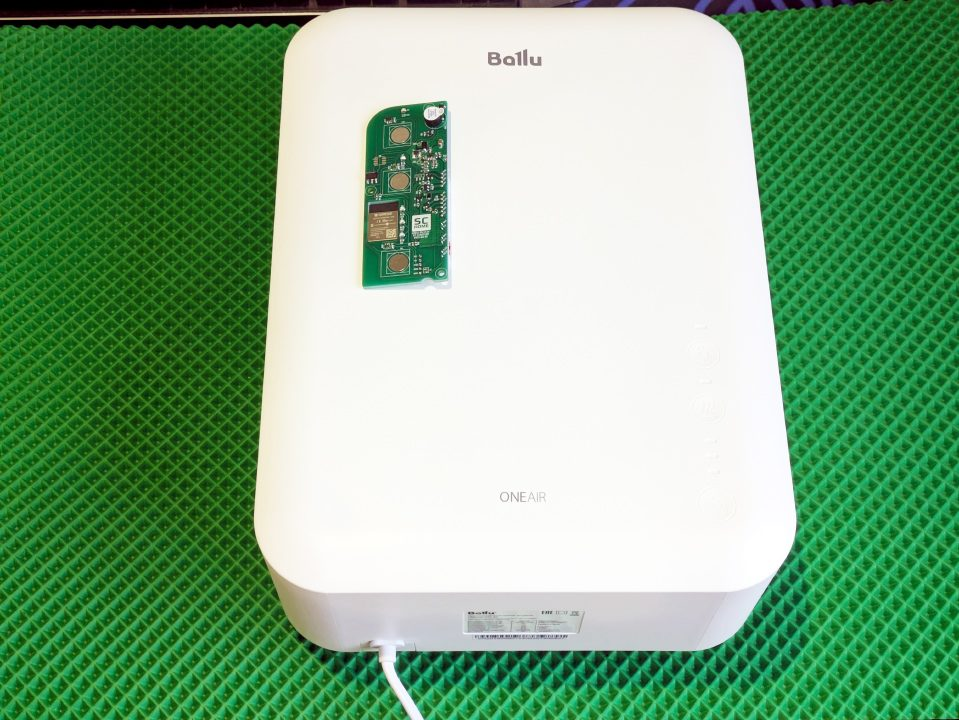

## Порядок работы

### Шаг 1. Снимаем бризер со стены (если установлен)

Откройте дверцу, снимите фильтр и решётку. Выкрутите **5 винтов** корпуса (4 из них — по углам под уплотнителем). Закройте дверцу, возьмитесь за воздуховод (патрубок) и аккуратно снимите бризер с крепления: держа за воздуховод (он сам выпадает).

- Пластиковые «ушки» по бокам — это **направляющие**, а не фиксаторы
- Мелкий болтик на турбине выкручивать **не нужно**
- Крепление к стене — на 3 самореза, при обратной установке не перепутайте

### Шаг 2. Разбираем корпус

Переверните бризер, откройте дверцу, снимите фильтр и (желательно) решётку с дверцы:

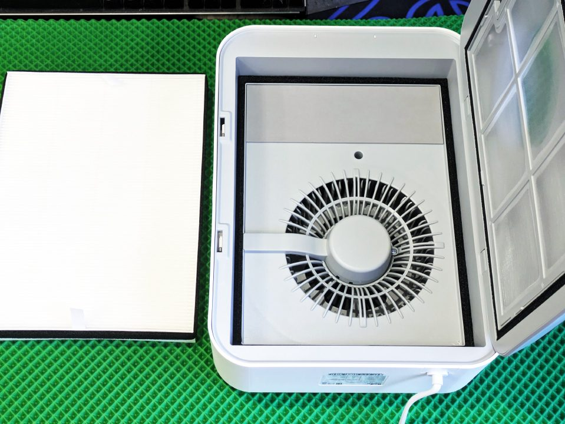

Выкрутите 5 винтов и аккуратно располовиньте корпус, следя за проводкой:

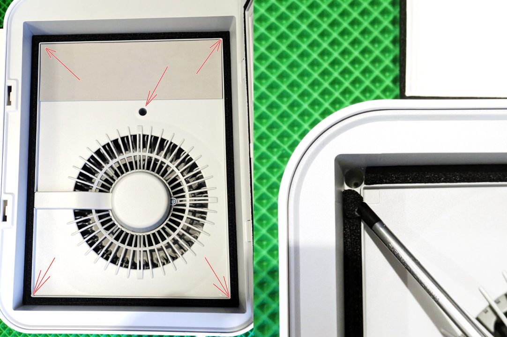
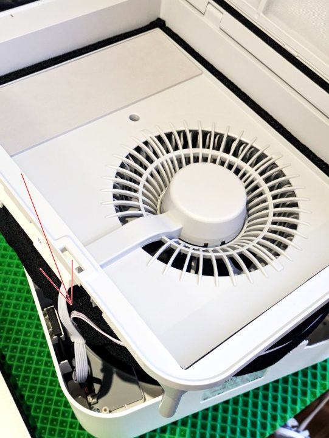
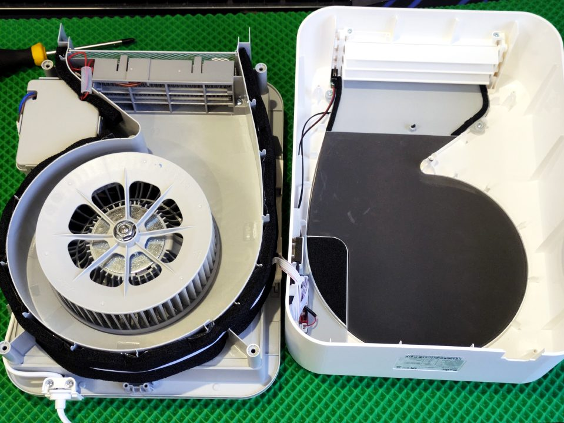

### Шаг 3. Меняем плату

1. Отсоедините разъёмы от штатной платы. **Запомните/сфотографируйте расположение!** Выкрутите 3 винта крепления:

   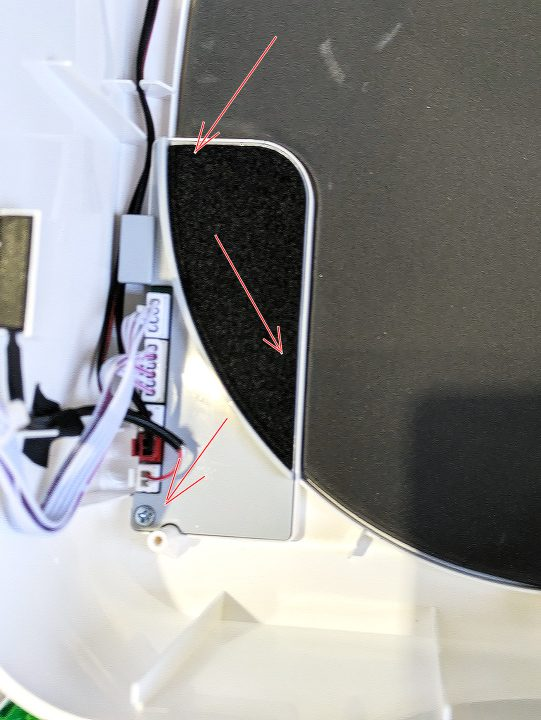

2. Извлеките штатную плату из корпуса:

   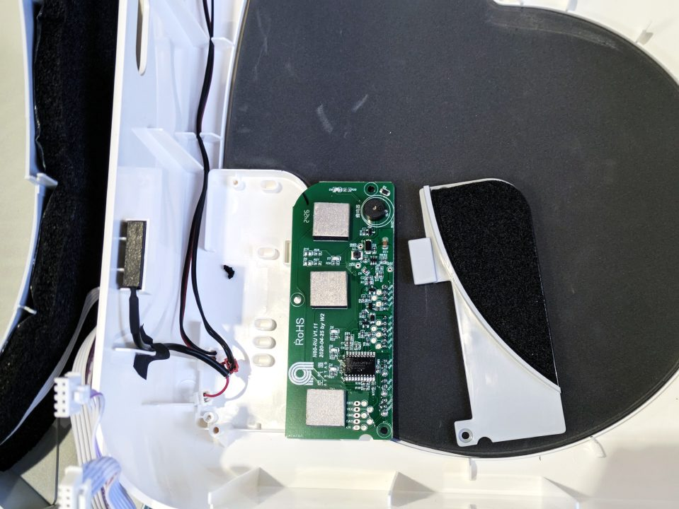

3. **Перенесите сенсорные «подушечки»** со штатной платы на подменную: они на токопроводящем двустороннем скотче — отрывайте медленно и осторожно. *«Нужны только руки, кривость рук роли не играет»* (автор).

   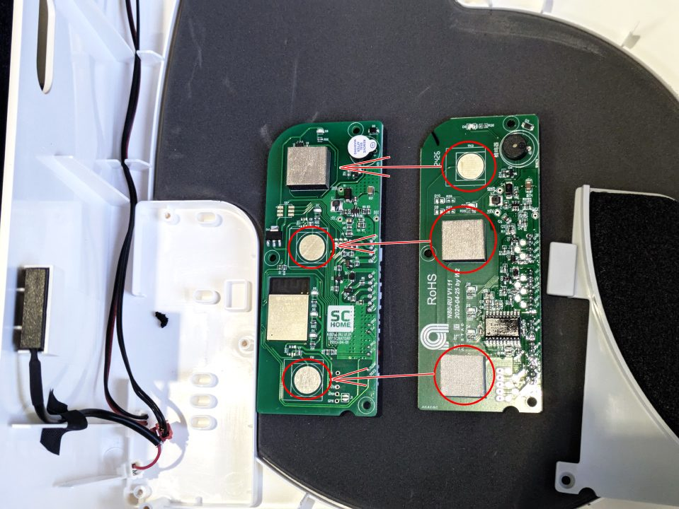

4. Вставьте подменную плату в корпус, закрутите 3 винта:

   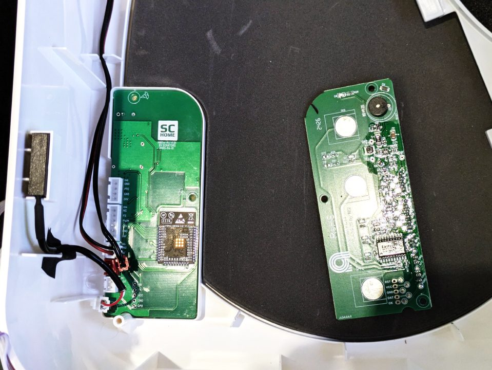

5. Подключите разъёмы

   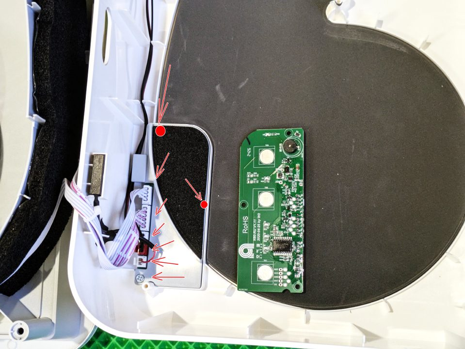

### Шаг 4. Сборка

**Это самый ответственный момент**, см. [предупреждения](#warnings)

Проложите провода, накройте крышкой, закрутите 5 винтов корпуса. **Не забудьте поставить кнопку открытия дверцы** (частая забытая деталь). Повесьте бризер на крепление.

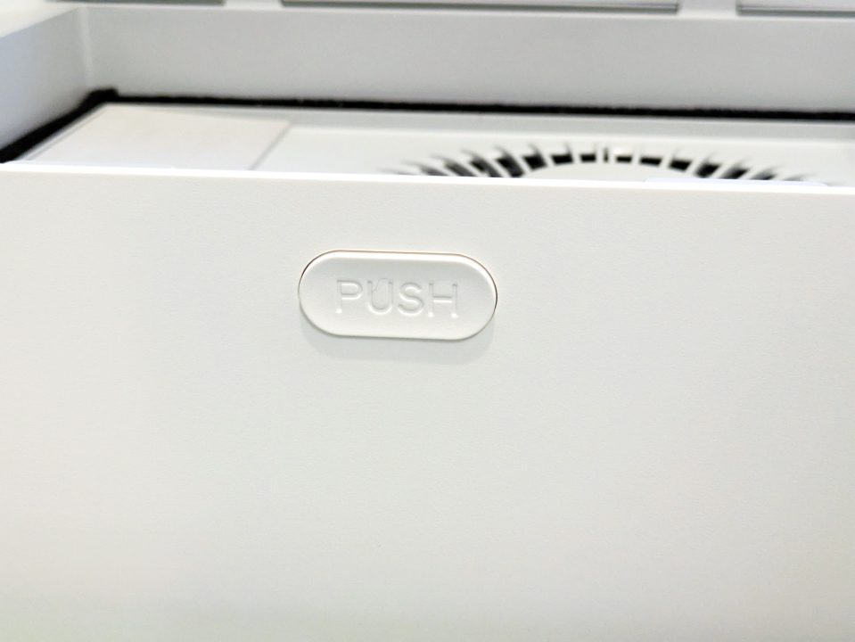

## ⚠️ Предупреждения: шлейфы, саморезы, первый запуск

Реальный случай из практики пользователя и советы автора платы. Пренебрегать не стоит — речь о устройстве с нагревателем на 600 Вт.

### Шлейфы и разъёмы — самый ответственный момент сборки

- **Разъёмы должны заходить сами, от лёгкого нажатия.** Не заходит — не давить. Посветите фонариком в гнездо: внутри не должно быть постороннего (шлейф, попавший мимо, загнутые контакты).
- **Перед закручиванием винтов корпуса убедитесь, что шлейфы не попали под них.**

Почему это важно — было несколько реальных случаев, когда в процессе сборки люди пробивали шлейфы. 

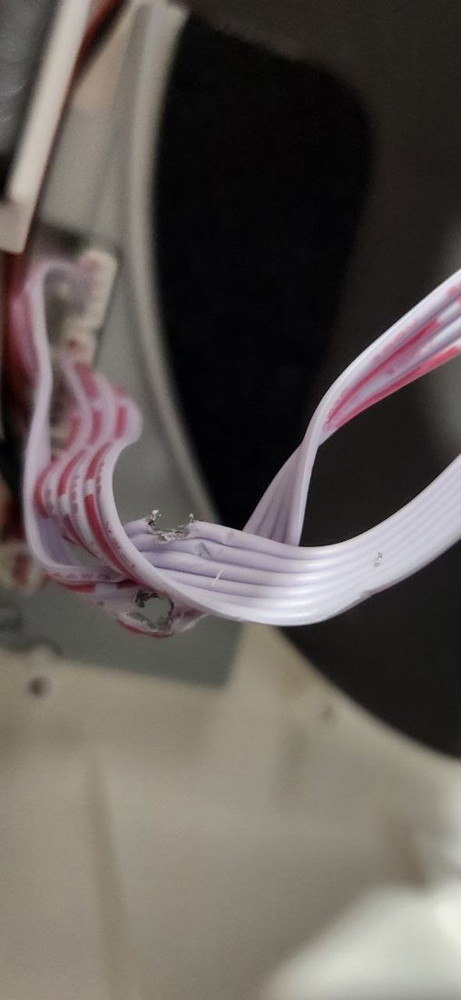

Автор платы по этому фото: *«5 миллиметров левее — и был бы феерверк»*. От беды спасло только то, что пользователь [следил за нагревом в первую минуту](#первая-минута-после-включения) и сразу обесточил бризер.

### Первая минута после включения

Сразу после первого включения **минуту внимательно следите за нагревателем**: воздух не должен стать аномально горячим, не должно быть запаха. Что-то не так — обесточьте немедленно и перепроверьте разъёмы.

### Дополнительные пункты

- Проверьте ваше вет-отверстие в стене: **внутри канала или на впускном дефлекторе не должно быть обратного клапана**, блокирующего поток воздуха с улицы. Бризеру клапан мешает: он не пропускает воздух с улицы, и бризер работает «вхолостую» — поток через корпус становится почти нулевым. Это плохо сразу по двум причинам: вентилятор длительно крутится без нормального протока, а включённый нагреватель остаётся без обдува — перегревается и может расплавить корпус. Важно: защита прошивки в этом случае не спасёт — она следит за оборотами турбины, а при перекрытом канале турбина может продолжать крутиться на оборотах, выше тех, что заложены в защите прошивки.

---

**Дальше:** плата установлена → [⚡ Быстрый старт](quick-start.md) или подробное [первое включение](03-first-run.md).

← [Оглавление](index.md)
